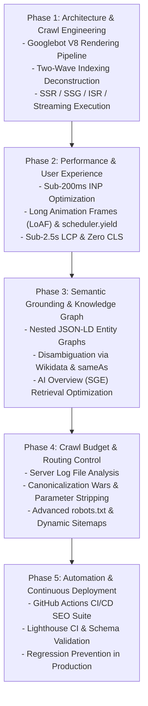

# Master Outline & Architectural Syllabus
**Book Title**: Perfect SEO 2026 October Edition  
**Subtitle**: The Senior Developer's Architectural Blueprint for Google Dominance  
**Target Audience**: Professional Google Website Developers, Frontend Architects, Full-Stack Engineers  
**Lead Architect**: Blueprint (Master Outline Architect)

---

## Architectural Pipeline Flowchart

---

## Detailed Chapter Specifications

### 00. Frontmatter
- **00_cover.md**: Full-page front cover artwork (Luxury tech blueprint design).
- **00_title_page.md**: Publication metadata, edition stamp (October 2026 Edition).
- **01_preface.md**: The Developer's SEO Crisis: Why marketing advice fails modern JavaScript frameworks and single-page applications.
- **02_the_100_percent_value_pledge.md**: The Developer's Standard: Every concept backed by code, browser mechanics, and deterministic audits.

### 01. Chapter 1: The 2026 Search Engine Architecture (Googlebot V8)
- How Googlebot crawls modern websites: URL Frontier, Web Crawler, and the Web Rendering Service (WRS).
- Two-Wave Indexing: Why relying on client-side JS execution delays indexation by days or weeks.
- The V8 Execution Budget: Resource constraints, script timeouts, and headless Chromium quirks.
- Action Item: Conducting an initial curl and raw DOM snapshot audit.

### 02. Chapter 2: Rendering Paradigms & Crawl Optimization (SSR, SSG, ISR)
- Evaluating modern rendering modes: Client-Side (CSR), Server-Side (SSR), Static Site Generation (SSG), and Incremental Static Regeneration (ISR).
- React Server Components (RSC) and HTML Streaming in Next.js 15 / Nuxt 3: Delivering immediate HTML to Googlebot before client hydration.
- The "Hydration Mismatch" penalty: How inconsistent DOM trees confuse search bots.
- Production Code: Setting up streaming metadata and dynamic robots/sitemap routes in Next.js App Router.

### 03. Chapter 3: Core Web Vitals & Real-User Performance Engineering
- The Interaction to Next Paint (INP) Deep Dive: Replacing FID; measuring input delay, processing time, and presentation delay.
- Identifying Long Animation Frames (LoAF) using Chrome DevTools Performance Profiler.
- Breaking up main thread long tasks (>50ms) using `scheduler.yield()`, `requestIdleCallback()`, and Web Workers.
- LCP Optimization: Preloading hero assets with `fetchpriority="high"`, modern AVIF/WebP image pipelines, eliminating render-blocking fonts (`font-display: swap`).
- CLS Elimination: Explicit `aspect-ratio` rules, preventing late-injected dynamic DOM elements.

### 04. Chapter 4: Semantic Graph Architecture & Structured Data (JSON-LD)
- Moving beyond isolated tags: Building a unified Knowledge Graph with nested JSON-LD.
- Entity Disambiguation: Using `sameAs` references to Wikipedia and Wikidata IDs to establish authoritative entity nodes.
- Core Developer Schemas: TechArticle, SoftwareApplication, Organization, WebPage, and BreadcrumbList.
- Code Template: A production-ready, TypeScript-typed nested Entity Graph.

### 05. Chapter 5: Crawl Budget, Canonicalization & Log File Engineering
- Server Access Log Analysis: Using Nginx/Cloudflare log parsers to track Googlebot frequency, status codes, and crawl waste.
- Faceted Navigation & Parameter Bloat: Controlling e-commerce and dynamic query parameters with canonical tags, `robots.txt` wildcards, and Google URL parameter tools.
- Resolving Canonicalization Wars: Self-referential canonicals, trailing slash standardization, and protocol redirects (HTTP $\to$ HTTPS, `www` vs non-`www`).

### 06. Chapter 6: Optimizing for Google AI Overviews & Semantic LLM Retrieval
- The Mechanics of Retrieval-Augmented Generation (RAG) in Google AI Overviews (SGE), SearchGPT, and Perplexity.
- The Information Gain Standard: Why generic content gets ignored in AI citations and how unique technical synthesis wins placement.
- Semantic Chunking & Question-Answer Markup: Formatting technical documentation so vector search models extract direct quote passages.

### 07. Chapter 7: The Developer's 50-Point CI/CD SEO Automation Suite
- Preventing SEO regressions in pull requests: Automating Lighthouse CI in GitHub Actions.
- Automated Schema JSON-LD validation and broken link crawling on every deployment.
- The 50-Point Production Deployment Checklist for Senior Developers.

### 99. Backmatter
- **01_code_templates_swipe_file.md**: Production TypeScript SEO metadata components, Nginx caching rules, and GitHub Actions workflow YAML.
- **02_about_the_author.md**: Jarvis & The Web Architecture Lab credentials.
- **99_back_cover.md**: Full-page back cover artwork with synopsis, barcode, and ratings.
